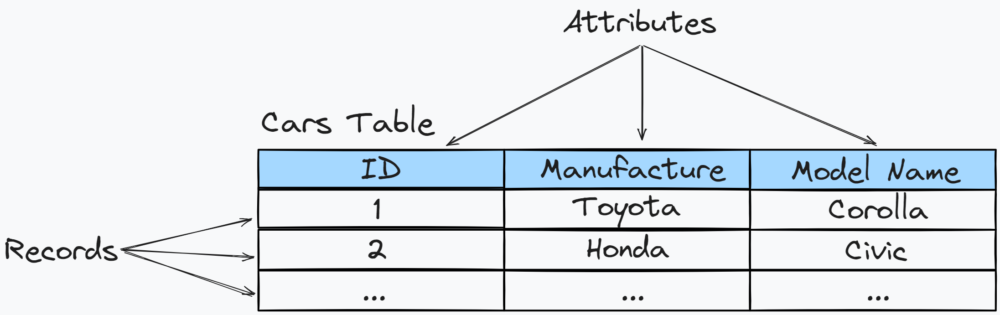
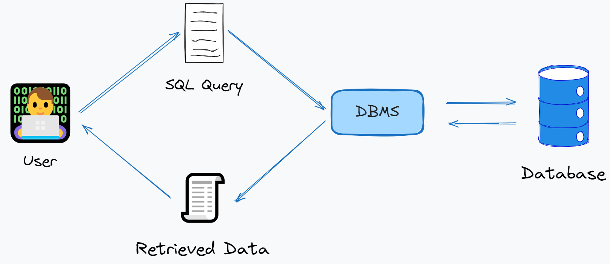

# Databases and DBMS

# Databases and DBMS 📚

At the beginning of the course we will cover the basics of databases and database management systems → *DBMS*. Understanding these concepts is key to working with SQL, as they determine how data is stored, organized, and processed. 

We will discuss the different types of databases, their architecture, and the main functions of a *DBMS*, which will help you better navigate the data environment.

<aside>
📖

**Database** — organized collection of data stored in a structured manner

</aside>

**Structured data** refers to information that is highly organized and formatted in a way that is easily searchable in a database. This type of data is typically stored in tables, which consist of rows and columns, similar to a spreadsheet 📑

Each column represents a specific attribute/field, while each row corresponds to a unique record:

Unfortunately, databases themselves are not useful without systems that allow you to manage them called *Database Management System*, shortly *DBMS.*

<aside>
📖

**DBMS** — ****set of tools and languages that allow access, create, modify and delete data, as well as ensure the security and integrity of the information

</aside>

In other words, *DBMS* is a *platform* through which we can create databases and interact with data. For better understanding, let’s have a look at this picture:

1. User writes SQL query to retrieve needed data 
2. SQL query is processed by *DBMS* to extract relevant information from a database
3. Retrieved data is returned back to a user via *DBMS*

# DBMS Zoo 🦁🦓🐦

There are many different types of *DBMS*. Just as each animal in a zoo has its unique characteristics and role within the ecosystem, each type of *DBMS* has its distinct features and use cases in the data management landscape.

| **DBMS** | **Type** |
| --- | --- |
| Microsoft SQL Server | Relational DBMS |
| PostgreSQL | Relational DBMS |
| SQLite | Relational DBMS |
| MySQL | Relational DBMS |
| Oracle | Relational DBMS |
| MongoDB | Document-oriented DBMS |
| Redis | Key-value storage |
| Snowflake | Cloud relational DBMS |
| Elasticsearch | Search engine |
| Neo4j | Graph DBMS |

From the table above we can extract the following types:

- *Relational DBMS*
- *NoSQL DBMS*
- *Graph DBMS*

More details about each type are available in the next chapters ➡️ 📚