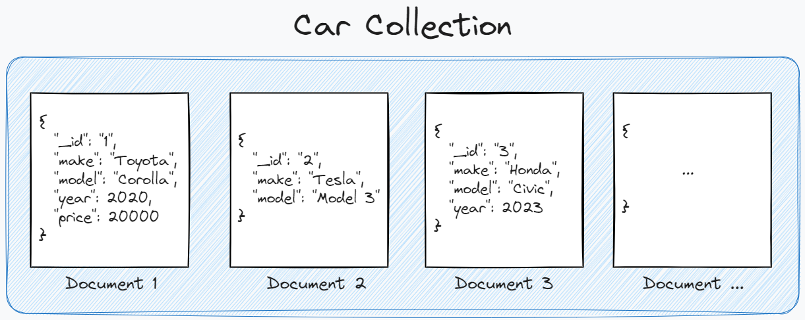

# Document-Oriented Databases

# Document-Oriented Databases 📄

Type of *NoSQL* database that stores data as documents, typically in *JSON*, *BSON*, or *XML* format. Unlike relational databases, where data is stored in tables, *document-oriented* databases offer flexibility in structure, allowing data to be stored with dynamic schemas, which is useful for applications that work with unstructured or semi-structured information.

<aside>
📖

**Document-Oriented Databases** — storing and processing data in a document format similar to *JSON*

</aside>

# Document-Oriented Database Example 🧪



In the example above we have *“Car Collection”* that includes several document. Each document describes an observation → similar to a row in *Relational Database*. You may notice that document don’t have fixed structure. For example, `Document 1` has 2 additional attributes in comparison to `Document 2` .

<aside>
💡

Documents within a collection may have different attributes and structure

</aside>

Unfortunately, you cannot use SQL to query the data. For example, one of the most popular document-oriented database called *MongoDB* uses its own query language called *MongoDB Query Language* that is based on *JavaScript-like* syntax. 

The query below demonstrates *how we can get number of documents where price > 5000:*

```sql
> db.cars.find({"price": {"$gt": 5000}})
```

# Advantages ⚡

- *Flexible Schema:*
    - Provide a flexible schema, meaning documents (often stored in *JSON* or *BSON* format) can have varying structures and fields.
    - This flexibility makes it easy to accommodate changes and adapt to evolving data requirements, enabling faster development cycles and allowing for unstructured or semi-structured data storage.
- *Ease of Use and Scalability:*
    - Document databases are designed to scale horizontally, making it easier to add more servers as data grows. They can handle large volumes of data and high *write/read* loads efficiently.
    - This scalability makes them suitable for applications that require high availability and the ability to manage big data, such as *content management systems* and *real-time analytics*.
- *Rich Query Capabilities:*
    - Offer powerful query capabilities that allow for complex searches and aggregations within documents, including support for *nested fields* and *arrays*.
    - This enables developers to perform detailed and diverse queries without needing complex joins, which simplifies data retrieval and manipulation

# Disadvantages 📉

- *Limited Transaction Support:*
    - Many document-oriented databases do not fully support *ACID* transactions across multiple documents, which can lead to data integrity issues in applications that require strict consistency.
    - This limitation can make them less suitable for applications where reliable transactions are critical, such as *financial systems* or situations requiring *multi-document updates*.
- *Potential for Data Redundancy:*
    - Due to their flexible schema, document databases may encourage *data redundancy*, as similar information can be duplicated across multiple documents.
    - This redundancy can lead to *increased storage costs* and potential *data inconsistency*, making it challenging to maintain data integrity when updates occur.
- *Limited Standardization:*
    - Often lack standardization in terms of *query languages*, *APIs*, and *data modeling practices*. Unlike SQL, which provides a consistent language across relational databases, each document database may have its own querying methods and features.
    - This can pose challenges for developers, particularly those less familiar with the technology, as they may face a steeper learning curve and less community support compared to more established database systems.

# Popular Document-Oriented Databases ❤️

- ***MongoDB***
    - One of the most popular NoSQL databases, MongoDB stores data in JSON-like documents and provides a flexible schema, making it ideal for applications that require scalability and performance.
    - *Use cases* **→** Web applications, real-time analytics, content management systems
- ***Couchbase***
    - **Description**: A distributed NoSQL document database with a flexible JSON format and powerful query capabilities, combining the best of key-value and document models.
    - *Use cases* **→** Mobile backends, content management, real-time applications.
- ***RethinkDB***
    - A real-time, document-oriented database that continuously pushes updated query results to applications, making it suitable for dynamic applications.
    - *Use cases* **→** Real-time analytics, collaborative applications, live dashboards.
- …